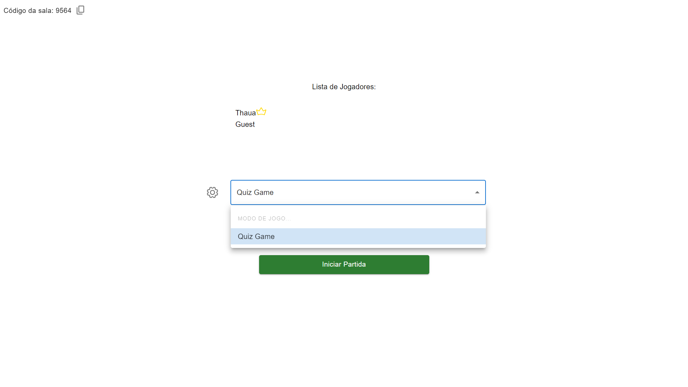

# <h1 align="center">
   WebSocket Quiz Game
</h1>

## 
 <u>Preview da aplicação:</u> 

  

> Este repositório contém uma aplicação web de quiz online que utiliza WebSockets para comunicação em tempo real. O objetivo inicial da aplicação é permitir que os usuários participem de um quiz online, porém, estão planejados novos modos de jogo como recursos futuros.

<h4 align="center"><a href="https://seu-link-aqui" target="_blank"><s>Clique para acessar a aplicação</s> Indisponível</a></h4>

---
# 💻 Tecnologias Utilizadas

As seguintes tecnologias foram utilizadas na construção do projeto:

- Typescript
- React
- Node.js
- Express.js
- WebSocket

# ⚙️ Instalação

### Client

  1. Atualize o arquivo Env
  2. `$ cd Client/`
  2. `$ npm install`
  3. `$ npm start`
     
### Api

  1. Atualize o arquivo Env
  2. `$ cd Server/`
  3. `$ npm install`
  4. `$ npm start`

# 🛠️ Funcionalidades

- Criar Lobby
- Entrar em Lobby a partir de código
- Ajustar configurações como rounds e tempo 
- Enviar respostas, revelar e avaliar

### Ajustes e melhorias

O projeto ainda está em desenvolvimento e as próximas atualizações serão voltadas nas seguintes tarefas:

- [ ] Adicionar novos módulos de jogos
- [ ] Atualizar design
- [ ] Hospedar aplicação para demonstração

---

Feito por Thauã Magalhães 👋🏽 Entre em contato!

 

